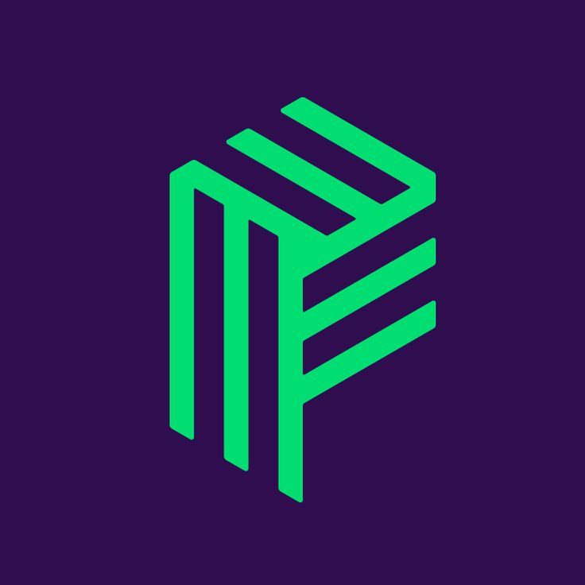

# Epic Movie Quotes - Backend
#### Author: [Davit Shkubuliani](https://www.linkedin.com/in/davit-shkubuliani/)

---

Welcome to Epic Movie Quotes - Backend! This is my first full-stack project developed using Vue.js and Laravel.
The project aims to provide a comprehensive and immersive user experience with a range of essential features.

The application includes user management functionalities such as user registration with email verification, password reset, and login.
Users can create their accounts securely and easily recover their passwords if needed.

Once authenticated, users gain access to various features, including movie and quote management.
They can create, read, edit, and delete movies and quotes, expressing their reactions through comments and likes.

To keep users informed in real-time, the application has live notifications feature. Users receive live notifications when someone comments or likes their quotes.

Epic Movie Quotes also integrates Laravel Socialite, enabling users to log in with their Gmail accounts effortlessly.
This feature enhances user convenience and offers more options for authentication.

The application is designed with responsiveness in mind, providing optimal viewing experiences on various devices.
It offers a seamless interface that adapts to different screen sizes, including desktop devices with a resolution of 1920x1080 and mobile devices with a resolution of 430x730.

Finally, Epic Movie Quotes supports bilingual functionality, offering both English and Georgian language options.
Users can explore and interact with the application in their preferred language.

#
## Table of Contents

* [Prerequisites](#prerequisites)
* [Getting Started](#getting-started)
* [Configuration](#configuration)
* [Development](#development)
* [Database Structure](#database-structure)
* [Resources](#resources)
* [Live Deployment](#live-deployment)


#
## Prerequisites

* &nbsp;&nbsp;*PHP@8.2 and up*
* &nbsp;&nbsp;*MYSQL@8 and up*
* &nbsp;&nbsp;*npm@6 and up*
* &nbsp;&nbsp;*composer@2.4 and up*


#

## Tech Stack
- &nbsp;[Laravel@10.x](https://laravel.com/docs/10.x) - back-end framework
- &nbsp;[TailwindCSS](https://tailwindcss.com/) - css framework for styles
- &nbsp;[Spatie Translatable](https://github.com/spatie/laravel-translatable) - package for translation
- &nbsp;[Laravel Pusher](https://swagger.io/docs/open-source-tools/swagger-ui/usage/installation/) - package for live notifications

#
## Getting Started
1. First of all you need to clone repository from github:
    ```sh
    git clone https://github.com/RedberryInternship/data-shkubuliani-epic-movie-quotes-api.git
    ```

2. Next step requires you to run *composer install* in order to install all the dependencies.
    ```sh
    composer install
    ```

3. Now we need to set our env file. Go to the root of your project and execute this command.
    ```sh
    cp .env.example .env
    ```


#
## Configuration

1. Modify the database configuration in your `.env` file. DB_PASSWORD is empty by default.
   >DB_CONNECTION=mysql

   >DB_HOST=127.0.0.1

   >DB_PORT=3306

   >DB_DATABASE=*****

   >DB_USERNAME=*****

   >DB_PASSWORD=*****

2. Run database migrations:
    ```shell
    php artisan migrate:fresh
    ```

3. Modify the email configuration in your `.env` file.
   >MAIL_DRIVER=smtp

   >MAIL_HOST=smtp.gmail.com

   >MAIL_PORT=465

   >MAIL_USERNAME=*****

   >MAIL_PASSWORD=*****

   >MAIL_ENCRYPTION=ssl

   >MAIL_FROM_NAME=*****

4. Modify oauth with Google configuration in your `.env` file.
   >GOOGLE_CLIENT_ID=*****

   >GOOGLE_CLIENT_SECRET=*****

   >GOOGLE_REDIRECT_URL=*****

5. Modify laravel sanctum configuration and also front-end url in your `.env` file.
   >SESSION_DOMAIN=*****

   >SANCTUM_STATEFUL_DOMAINS=*****

   >FRONTEND_URL=*****

6. Modify broadcasting configuration in your `.env` file.
   >BROADCAST_DRIVER=pusher

   >PUSHER_APP_ID=******

   >PUSHER_APP_KEY=******

   >PUSHER_APP_SECRET=******

   >PUSHER_APP_CLUSTER=**

#
## Development

You need to start Laravel server:

```shell
php artisan serve
```


#
## Database Structure
[*drawSQL link*](https://drawsql.app/teams/datas-team/diagrams/epic-movie-quotes)


#
## Live Deployment

https://epic-movie-quotes.data-shkubuliani.redberryinternship.ge/


#
## Resources
[Project Design](https://www.figma.com/file/5uMXCg3itJwpzh9cVIK3hA/Movie-Quotes-Bootcamp-assignment?type=design&node-id=0-1&mode=design&t=mRwkH2ZrQLIlxnQT-0)
